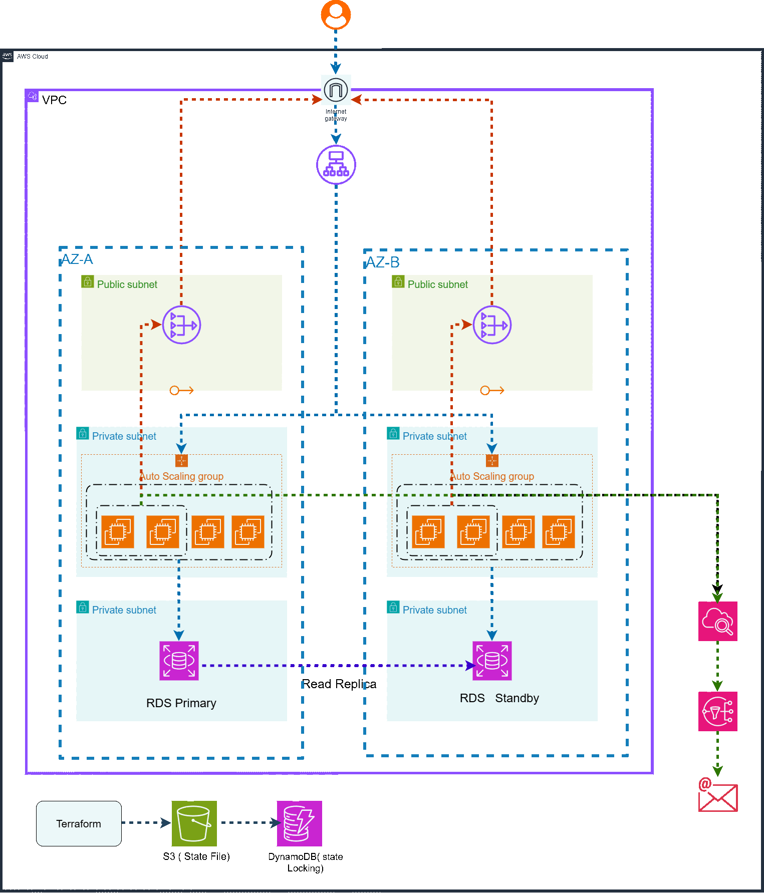

# 🚀 Production-Grade 3-Tier AWS Architecture (Terraform)


---

## 📌 Overview

This project implements a **production-style 3-tier AWS architecture** using modular Terraform.

It demonstrates:

- Infrastructure as Code (IaC)
- Secure network segmentation
- Multi-AZ high availability
- Auto Scaling compute layer
- Enterprise-grade RDS deployment
- Remote state management (S3 + DynamoDB)
- CloudWatch monitoring & alerting
- Security group chaining between tiers

This architecture reflects real-world cloud engineering best practices.

## 🧠 Architecture Principles

This infrastructure was designed following core cloud architecture principles:

- **High Availability**  
  Resources are distributed across multiple Availability Zones to ensure service continuity during failures.

- **Scalability**  
  The application layer uses an Auto Scaling Group to automatically adjust capacity based on demand.

- **Security by Design**  
  Strict security group chaining ensures tier isolation:
  - ALB → EC2
  - EC2 → RDS

- **Network Segmentation**  
  Public, private application, and private database subnets are separated to reduce attack surface.

- **Infrastructure as Code**  
  Terraform modules enable reproducible, version-controlled infrastructure deployments.

- **Observability**  
  CloudWatch metrics and SNS alerts provide operational visibility.

- **State Management**  
  Terraform remote state stored in S3 with DynamoDB locking ensures safe collaborative infrastructure changes.
## ☁️ AWS Services Used

- Amazon VPC
- Internet Gateway
- NAT Gateway
- Application Load Balancer (ALB)
- EC2 Auto Scaling Group
- Amazon RDS MySQL (Multi-AZ + Read Replica)
- Amazon CloudWatch
- Amazon SNS
- Amazon S3 (Terraform State)
- Amazon DynamoDB (State Locking)
---

## 🏗 Architecture Diagram

📍 This architecture was fully provisioned using Terraform and deployed in AWS ca-central-1 (Canada).
### Logical Flow

            ┌──────────────────────────┐
            │        Internet          │
            └─────────────┬────────────┘
                          │
                          ▼
            ┌──────────────────────────┐
            │ Application Load Balancer│
            │     (Public Subnets)     │
            └─────────────┬────────────┘
                          │
                          ▼
            ┌──────────────────────────┐
            │  EC2 Auto Scaling Group  │
            │   (Private App Subnets)  │
            └─────────────┬────────────┘
                          │
                          ▼
            ┌──────────────────────────┐
            │  RDS MySQL(Multi-AZ      |
            │     + Read Replica)      |
            │   (Private DB Subnets)   │
            └──────────────────────────┘

---
### Architecture Highlights
- Multi-AZ deployment across two Availability Zones  
- Public subnets host the Application Load Balancer and NAT Gateways  
- Private application subnets run EC2 instances inside an Auto Scaling Group  
- Private database subnets host Amazon RDS with Multi-AZ failover  
- A Read Replica provides additional read scalability  
- CloudWatch monitors infrastructure and triggers SNS alerts  
- Terraform state is stored remotely in S3 with DynamoDB state locking

## 🧱 Network Architecture

| Layer | Subnet Type | Internet Access | Purpose |
|------|-------------|----------------|--------|
| ALB | Public Subnets | Direct via Internet Gateway | Handles incoming user traffic |
| EC2 | Private App Subnets | Outbound via NAT Gateway | Runs application layer |
| RDS | Private DB Subnets | No internet access | Secure database layer |
| NAT Gateway | Public Subnets | Outbound internet access | Allows private instances to reach internet |
---
## Enterprise Database Architecture
### High Availability (Multi-AZ)

The primary RDS instance is deployed in Multi-AZ mode, providing:

 - Synchronous standby replica
 - Automatic failover during AZ failure
 - Same database endpoint after failover
 - Minimal downtime

If one Availability Zone fails, AWS automatically promotes the standby instance.
### Read Scaling (Read Replica)
A dedicated Read Replica is deployed to:

- Offload read-heavy workloads
- Improve scalability
- Support horizontal database scaling

Characteristics:
- Asynchronous replication
- Separate endpoint
- Can be manually promoted if needed

Multi-AZ ensures availability.
Read Replica ensures scalability.
## 🔐 Security Design

This architecture implements strict tier isolation:

- ALB allows HTTP from `0.0.0.0/0`
- EC2 only accepts traffic from ALB security group
- RDS only accepts traffic from EC2 security group
- Database is not publicly accessible
- DB runs in isolated private DB subnets
- Encrypted storage enabled on RDS

This ensures layered defense and minimized attack surface.

---

## ⚙️ Features Implemented
- VPC with public, private app, and private DB subnets
- Internet Gateway + NAT Gateway
- Multi-AZ Application Load Balancer
- Auto Scaling Group spanning multiple Availability Zones
- CPU Target Tracking (50%)
- RDS MySQL (Multi-AZ enabled)
- Dedicated Read Replica
- Dedicated DB Subnet Group
- Security Group chaining (ALB → EC2 → RDS)
- CloudWatch monitoring
- SNS email alerts
- Modular Terraform structure
- Remote state management (S3 + DynamoDB locking)

---

## 📂 Project Structure

```
📂 Project Structure
multi-tier-aws/
│
├── modules/
│   ├── network/
│   ├── security/
│   ├── loadbalancer/
│   ├── compute/
│   ├── database/
│   └── monitoring/
│
├── main.tf
├── variables.tf
├── outputs.tf
├── terraform.tfvars.example
└── README.md
```
---

## 🗄 Terraform Remote State Management

This project uses a production-ready Terraform backend configuration:

- Remote state stored in **Amazon S3**
- State locking implemented using **DynamoDB**
- Server-side encryption enabled
- Centralized state for collaborative deployments

## 🚀 Deployment Instructions

### 1️⃣ Clone Repository
```bash
git clone https://github.com/mia-rashel/Production-Grade-3-Tier-AWS-Architecture
cd Production-Grade-3-Tier-AWS-Architecture
```
### 2️⃣ Create Your Own Variables File

Copy:

cp terraform.tfvars.example terraform.tfvars

Update values:

vpc_cidr    = "10.0.0.0/16"

my_ip       = "YOUR_PUBLIC_IP/32"

db_username = "admin"

db_password = "StrongPassword123!"

alert_email = "your-email@example.com"

### 3️⃣ Initialize Terraform

```bash
terraform init
terraform plan
terraform apply
```
### 4️⃣ Access Application

After apply completes:

terraform output alb_dns_name

Paste the DNS name into your browser.

## 💰 Cost Awareness

This architecture uses small instance sizes for demonstration purposes:

- EC2: `t2.micro`
- RDS: `db.t3.micro`

However, resources such as NAT Gateways and RDS Multi-AZ deployments incur costs.  
For lab environments, resources should be destroyed after testing.
```bash
terraform destroy
```

## 📊 Monitoring & Scaling

### Auto Scaling Policy:

- Target Tracking

- 50% Average CPU Utilization

### Monitoring:

- CloudWatch metrics
- RDS connection tracking
- SNS email alerts

## 🏆 Production-Grade Characteristics

This project demonstrates:

- Logical + network-level tier isolation
- Infrastructure as Code (modular design)
- No hardcoded credentials
- Secure subnet segmentation
- Automated scaling
- Observability integration
- Encrypted database storage

## 🔮 Possible Enhancements

- HTTPS (ACM + TLS)
- WAF integration
- CI/CD pipeline (GitHub Actions)
- Secrets Manager integration
- Blue-Green or Canary deployments
---
## 🧠 Author
**Muhammad Rashel Mia**  
*Cloud & DevOps Engineer*
